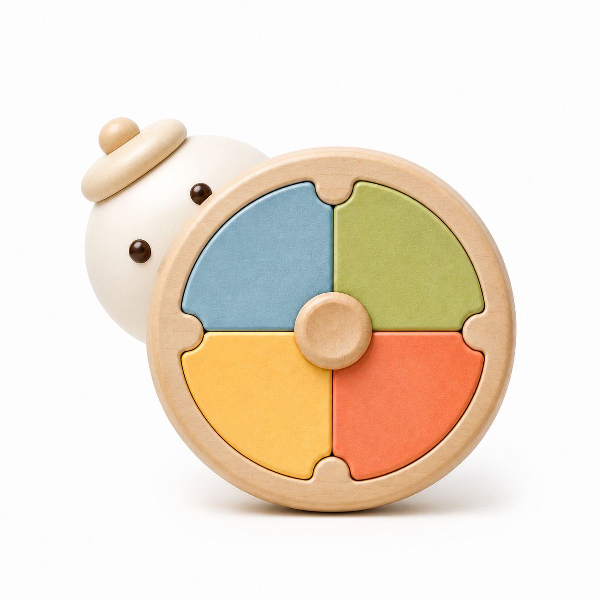
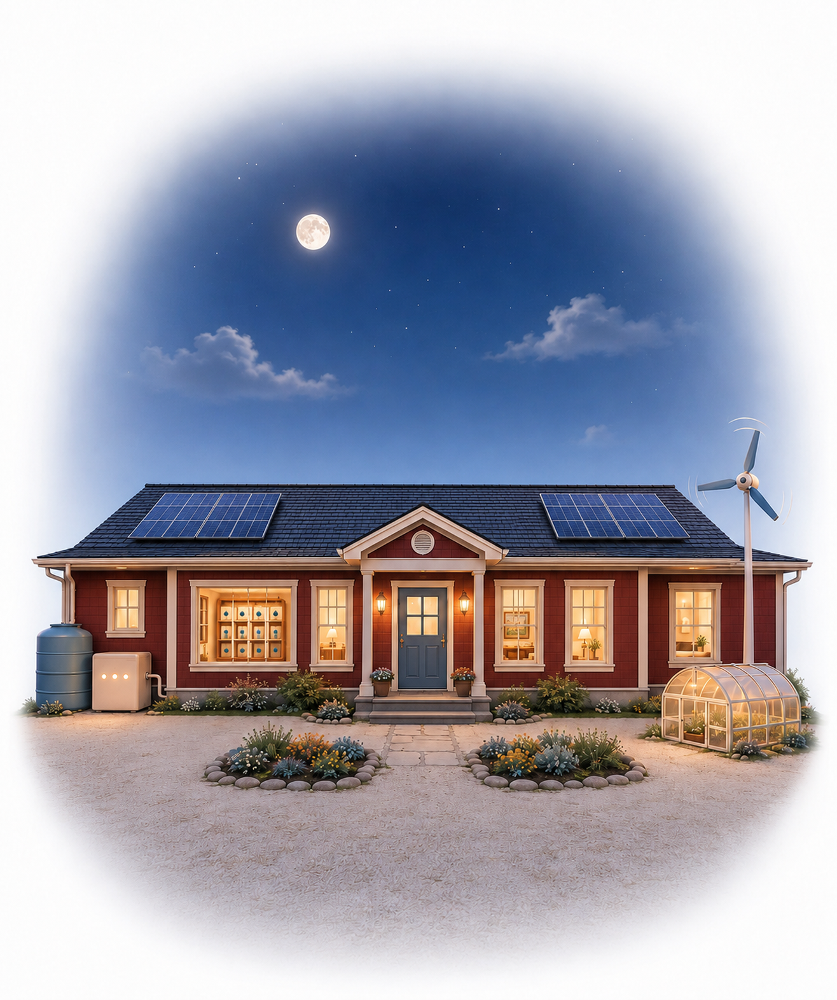
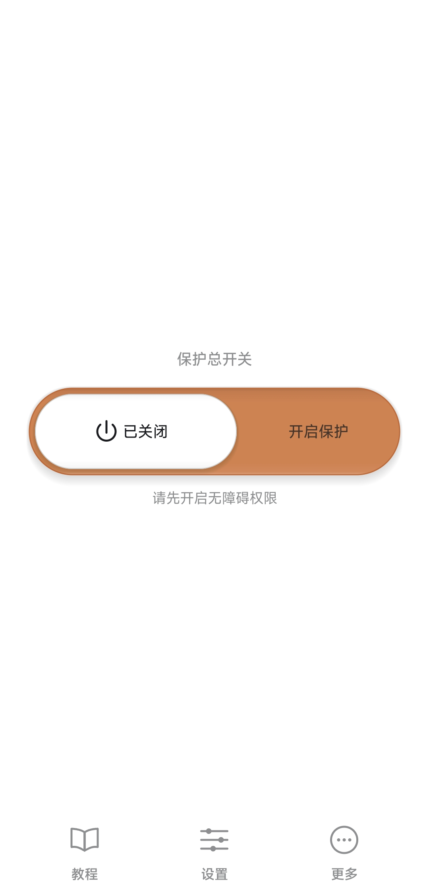
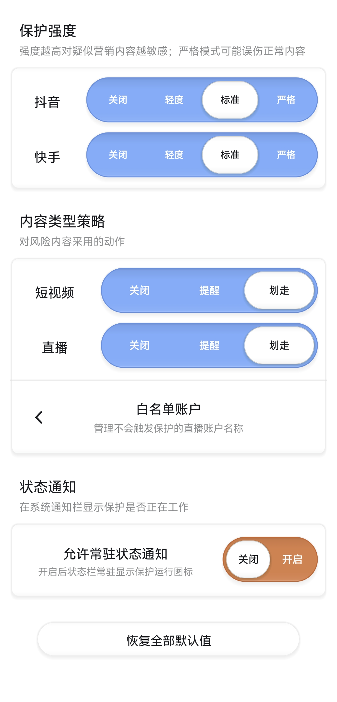
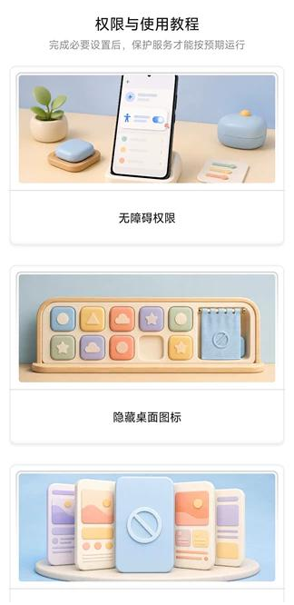
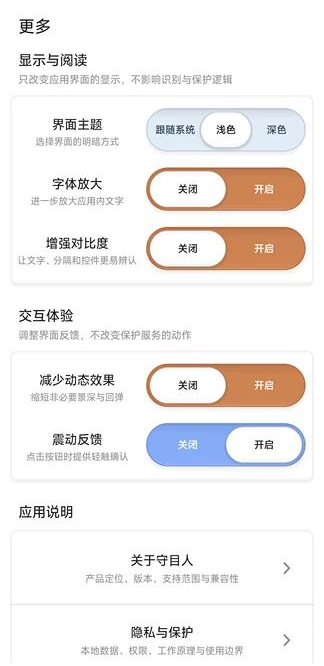

<p align="center">
  
</p>

<h1 align="center">🛡️ Gravekeeper</h1>

<p align="center">
  <a href="README.md">简体中文</a> | <a href="README.en.md">English</a>
</p>

<p align="center">
  <strong>Fully offline health-marketing shield for short videos and livestreams</strong>
</p>

<p align="center">
  <a href="https://github.com/AvalonskyAfar/Gravekeeper/releases"></a>
  <a href="Gravekeeper/LICENSE"></a>
  
  
  
</p>

<p align="center">
  <a href="#-features">Features</a> ·
  <a href="#-how-it-works">How It Works</a> ·
  <a href="#-screenshots">Screenshots</a> ·
  <a href="#-quick-start">Quick Start</a> ·
  <a href="#-building">Building</a> ·
  <a href="#-privacy--security">Privacy</a> ·
  <a href="#-tech-stack">Tech Stack</a> ·
  <a href="#-contributing">Contributing</a> ·
  <a href="#-license">License</a>
</p>

---

Gravekeeper is a local protection tool running on Android 11+ devices. While users browse Douyin, Kuaishou and other short-video/livestream platforms, the app analyses screen content in real time via the accessibility service, uses on-device AI models to identify health supplement marketing, exaggerated efficacy claims, and anxiety-inducing health content, then either sends a notification or automatically skips the video based on the user's settings.

> **🔒 All analysis happens locally on the device. No internet, no uploads, no stored screen data.**

<p align="center">
  
  
  
</p>

---

## ✨ Features

### 🧠 Intelligent Detection

| Feature | Description |
|---------|-------------|
| 🔍 On-device multi-model fusion | Custom MobileNetV3-Small vision model + character-level text classifier + 18-feature fusion strategy, all running locally on the phone |
| 📱 Multi-content-type detection | Distinguishes short videos, livestreams, and unknown page types, applying separate detection parameters and thresholds for each |
| 💊 Health-marketing signal detection | Combines visual, textual, price, shopping cart, checkout prompt, health-term, elderly-targeting, negative-context, and global-purchase risk signals |
| 🛡️ Negative-context protection | Automatically reduces false positives for science communication, myth-busting, fraud exposure, regulatory content, and purchase-discouraging content |

### ⚙️ Protection Strategy

| Feature | Description |
|---------|-------------|
| 🎚️ Multiple strength levels | Independently configurable sensitivity per platform (Douyin / Kuaishou) and content type (short video / livestream) |
| 👆 Alert or auto-skip | Risk content can trigger a notification alert or automatically perform an upward swipe according to the configured strategy |
| 📋 Livestream whitelist | Whitelist trusted livestream accounts; whitelisted content does not trigger protection |

### 🌙 Stealth & Low Power

| Feature | Description |
|---------|-------------|
| 👻 Hidden mode | Can hide the launcher icon and remove from the recent tasks list for silent operation |
| 🔋 Low-power mode | Supports reduced detection frequency, low-battery pause, and consecutive-failure protection |
| ⏱️ Smart activation | Only activates when a target app is in the foreground; automatically pauses when the user leaves, locks the screen, or the screen turns off |

### 🔔 Notifications & Controls

| Feature | Description |
|---------|-------------|
| 📡 Persistent status notification | Displays protection status in the notification bar with quick-stop support |
| 🎨 Full user interface | Light / dark theme, font scaling, contrast enhancement, step-by-step tutorial |

---

## 🔧 How It Works

```
Screen frame + OCR text
        │
        ├──▶ MobileNetV3-Small vision model (192×416 RGB)
        │      Determines page type, marketing intensity, health domain, elderly targeting
        │
        ├──▶ ML Kit Chinese OCR ──▶ Character n-gram hashing + text classifier
        │      Analyses sales, health, and elderly-relevance signals
        │
        ├──▶ Rule engine
        │      Price, shopping cart, checkout prompts, whitelist, frame state
        │
        └──▶ 18-feature fusion (logistic regression + temporal aggregation)
               │
               ▼
         Risk decision → Alert / Auto-skip
```

| Module | Description |
|--------|-------------|
| 👁️ Vision model | Input `float32[1,3,416,192]`; outputs page type, marketing intensity, five health-domain labels, and elderly-targeting probability |
| 📝 Text model | Character-level 1–4 gram hash features (262 144 dimensions) + three independent `LogisticRegression` classifiers, INT8 quantised |
| 🔗 Fusion model | `StandardScaler → LogisticRegression`; receives vision scores, text scores, and 16 rule features; outputs final probability |

> 📦 For detailed model documentation, training data, and runtime contracts, see the [model repository](https://huggingface.co/AvalonskyAfar/KeepersEye-1).

---

## 📱 Screenshots

| Main | Settings | Tutorial | More |
|:---:|:---:|:---:|:---:|
|  |  |  |  |

---

## 🚀 Quick Start

### 📥 Download & Install

1. Download the latest APK from [Releases](https://github.com/AvalonskyAfar/Gravekeeper/releases)
2. Install on an Android 11+ (API 30) device
3. On first launch, follow the tutorial to grant accessibility permission
4. Toggle the master protection switch to start using

### 📋 System Requirements

| Requirement | Value |
|-------------|-------|
| 🤖 Android version | 11+ (API 30) |
| 💻 Architecture | arm64-v8a |
| 🔐 Required permissions | Accessibility service, Notifications |
| 🌐 Network requirement | **None** — runs fully offline |

---

## 🔨 Building

### 🛠️ Prerequisites

- Android Studio (or Gradle command line)
- JDK 17
- Android SDK 36

### ⚡ Compile

```bash
# Enter project directory
cd Gravekeeper

# Debug build
./gradlew :app:assembleDebug

# Release build
./gradlew :app:assembleRelease
```

Build outputs are located in `app/build/outputs/apk/`.

### 🧪 Run Tests

```bash
./gradlew :app:testDebugUnitTest
```

### 📦 Key Dependencies

| Component | Version | Description |
|-----------|---------|-------------|
| LiteRT | 2.1.4 | Google AI Edge on-device inference runtime |
| ML Kit Text Recognition (Chinese) | 16.0.1 | Google on-device Chinese OCR |
| JUnit | 4.13.2 | Unit test framework (dev only) |

---

## 🔒 Privacy & Security

Gravekeeper treats user privacy as a core design principle:

| Commitment | Description |
|------------|-------------|
| ✅ Fully offline | Does not request internet permission; does not connect to any remote server |
| ✅ In-memory only | Screen content participates in instant analysis in device memory only; no screenshot files are written |
| ✅ Zero data upload | Does not upload screenshots, OCR text, account names, video content, detection results, or performance data |
| ✅ Minimal permissions | Uses only the accessibility service (screen reading + gesture execution), notification permission, and usage-stats permission |
| ✅ Revocable at any time | Users can disable protection, revoke accessibility permission, or uninstall the app at any time |

> The app does not declare `INTERNET`, `ACCESS_NETWORK_STATE`, foreground service, wake lock, boot-complete, or screen-recording permissions.

> ⚠️ **Note:** This is a local assistive tool, not a medical, legal, or financial decision system. The model may produce false positives on new interfaces, low-quality frames, occluded views, and health-education content. The auto-skip feature should be enabled by the user voluntarily and at their own discretion.

---

## 🧩 Tech Stack

| Layer | Technology | Purpose |
|-------|------------|---------|
| 👁️ Vision model | MobileNetV3-Small (PyTorch → LiteRT) | Screen analysis: page type, marketing intensity, health domain, elderly targeting |
| 📝 Text recognition | Google ML Kit Text Recognition v2 (Chinese) | On-device Chinese OCR |
| 🔤 Text classification | Scikit-learn HashingVectorizer + LogisticRegression (INT8) | Character-level text feature analysis |
| 🔗 Fusion decision | Scikit-learn StandardScaler + LogisticRegression | 18-feature normalised fusion |
| 📱 App framework | Android Java (View system) | UI, accessibility service, lifecycle |
| ⚡ Inference runtime | Google AI Edge LiteRT 2.1.4 | On-device vision model inference |
| 🔨 Build tooling | Gradle + Android Gradle Plugin | Compilation, obfuscation, signing |

---

## 📂 Project Structure

```
software/                    Repository root
├── screenshots/              App screenshots used in this README
├── Gravekeeper/              Android app source (Gradle project)
│   ├── app/src/main/java/    Application code
│   ├── app/src/main/assets/  Runtime models and config
│   ├── app/src/test/         Unit tests
│   └── app/src/main/res/     Resources
├── Gravekeeper-2.1-arm64.apk   Signed release build
└── Gravekeeper-2.1-debug.apk   Debug build
```

---

## 🤝 Contributing

Gravekeeper is currently a solo project built under limited conditions; there is significant room for improvement in both the models and the software. Contributions of any kind are welcome:

- 🧠 **Model improvement** — Optimise the vision model, text classifiers, and fusion strategy to improve detection accuracy and reduce false positives. Training tools and evaluation data are provided in the repository; you can iterate on the existing pipeline directly.
- 💻 **Software development** — Fix bugs, optimise performance, add new features, support more platforms and devices.
- 📊 **Data annotation** — Help label more real-world video frames to expand the training set.
- 🐛 **Issue reports** — Any problems or suggestions encountered during use are welcome as Issues.
- 📖 **Documentation** — Improve tutorials, add translations, or supplement explanations.

> 💡 **Want to contribute?** Fork this repository, make your changes, and submit a Pull Request. If you're interested in model training, see the detailed instructions and training pipeline in the [model repository](https://huggingface.co/AvalonskyAfar/KeepersEye-1).

---

## 💖 Special Thanks

| Contributor | Description |
|-------------|-------------|
| 🌐 [api.uniprep.world](https://api.uniprep.world/) | Provided free AI coding API access throughout the entire project. From data annotation and model training to Android engineering, this API was critical support under an extremely limited budget |
| 🔧 [Google AI Edge LiteRT](https://github.com/google-ai-edge/LiteRT) | On-device model inference runtime |
| 📝 [Google ML Kit](https://developers.google.com/ml-kit/vision/text-recognition/v2) | On-device Chinese OCR capability |
| 🙏 All contributors | Data collection, manual annotation, review, real-device testing, and troubleshooting |

---

## 📄 License

This project is licensed under the [MIT License](Gravekeeper/LICENSE). You are free to use, modify, and distribute it.

| Content | License |
|---------|---------|
| 📦 Application code | [MIT](Gravekeeper/LICENSE) |
| 🧠 Models & training artefacts | [CC BY-NC 4.0](https://creativecommons.org/licenses/by-nc/4.0/) |
| 🔗 Third-party components | Subject to their respective upstream licences |

---

<p align="center">
  <sub>🛡️ Guarding your view from health-marketing noise.</sub>
</p>